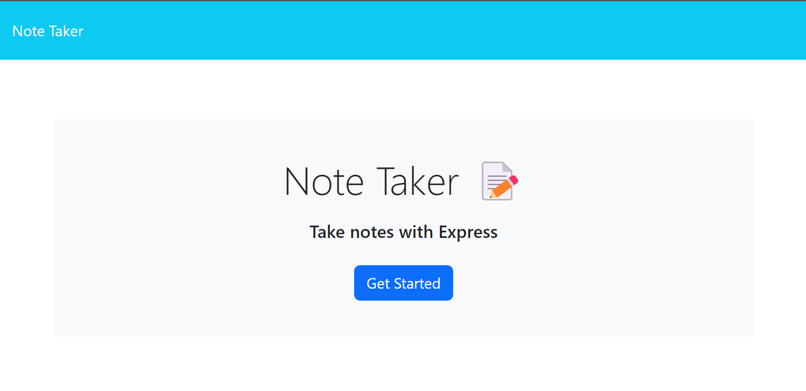
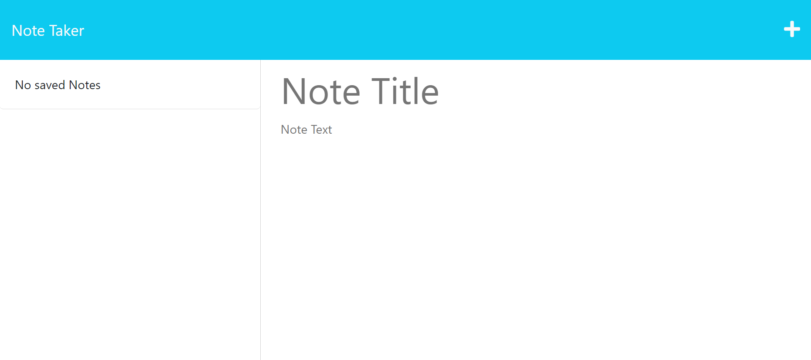
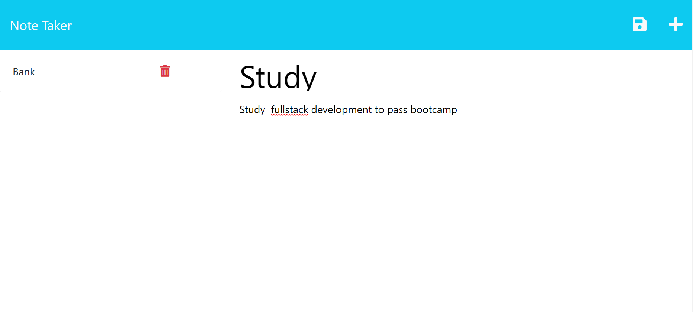
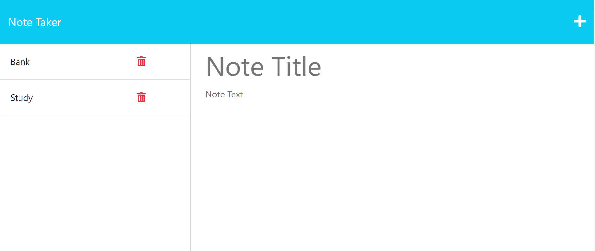

# i-dont-study
## Description

I Dont Study is a note taking application that allows the user to add and delete notes to a database. Everything you write and save or delete updates the database that is being used by the server.

## Table of Contents

- [Technology](#Technology)
- [Features](#features)
- [Usage](#usage)
- [License](#license)

## Technology

- JavaScript
- Node.js
- Express
- Uniqid

## Features

- Area to create and write notes
- Save button to save notes
- Side bar containing all of the saved notes
- Delete button to discard any old notes

## Usage

The user will first be presented with this landing page; click 'Get Started' to continue

This is the homepage where the user can write and enter notes

When the user is finished writing their notes, they can then save the notes

The user can then click the delete icon next to the note to get rid of the note

Repository Link: https://github.com/CullenKnott/i-dont-study

deployment Link: 

## License

MIT License

Copyright (c) [2023] [CullenKnott]

Permission is hereby granted, free of charge, to any person obtaining a copy of this software and associated documentation files (the "Software"), to deal in the Software without restriction, including without limitation the rights to use, copy, modify, merge, publish, distribute, sublicense, and/or sell copies of the Software, and to permit persons to whom the Software is furnished to do so, subject to the following conditions:

The above copyright notice and this permission notice shall be included in all copies or substantial portions of the Software.